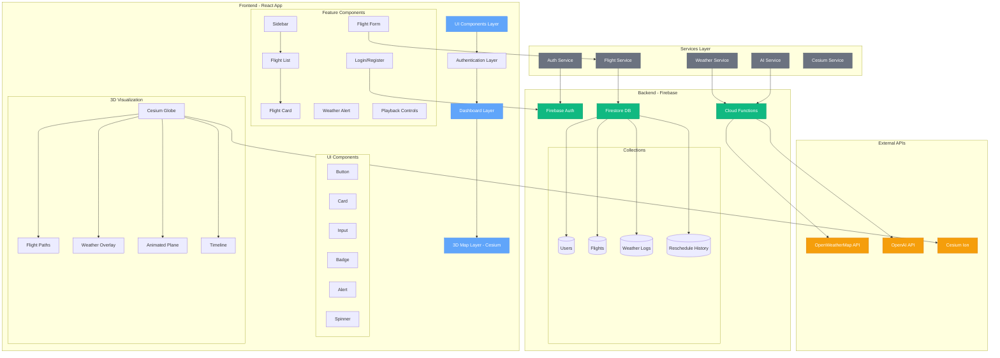
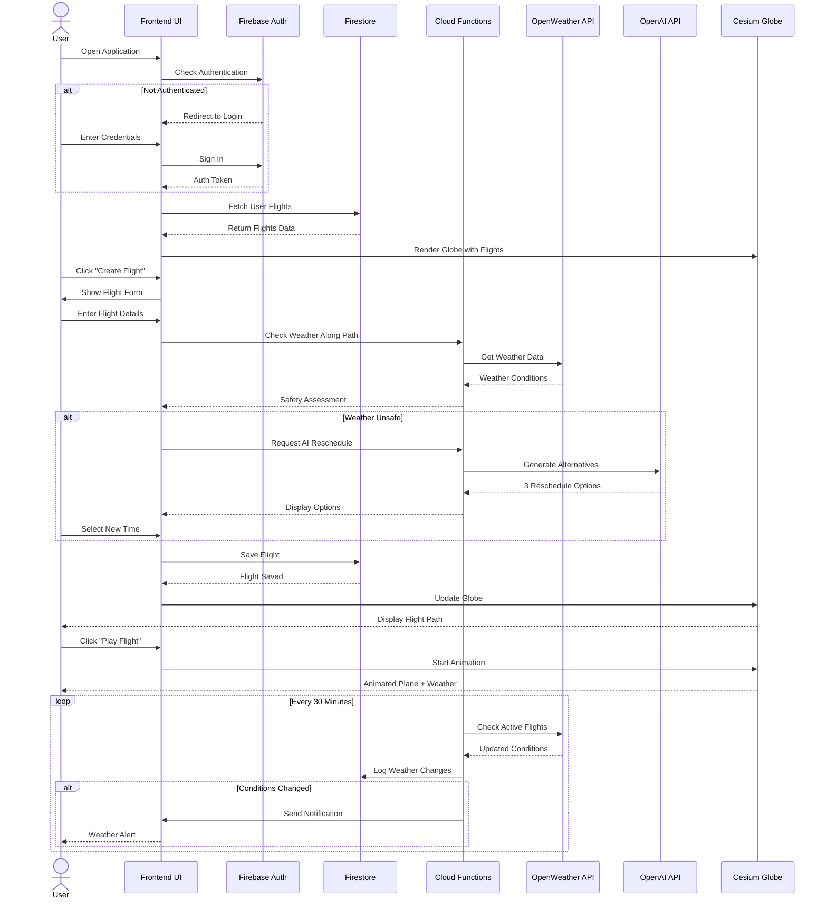
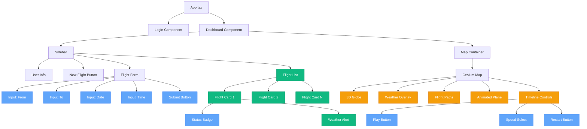
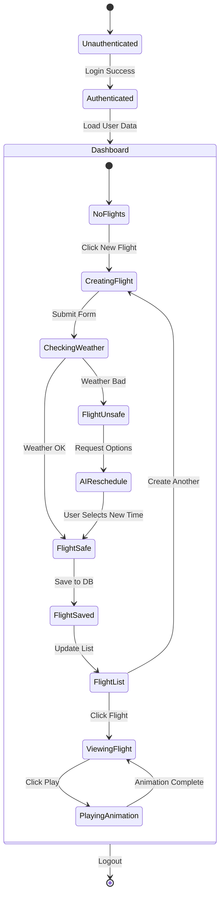
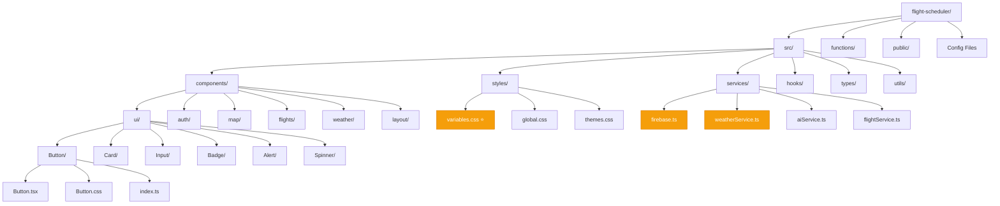
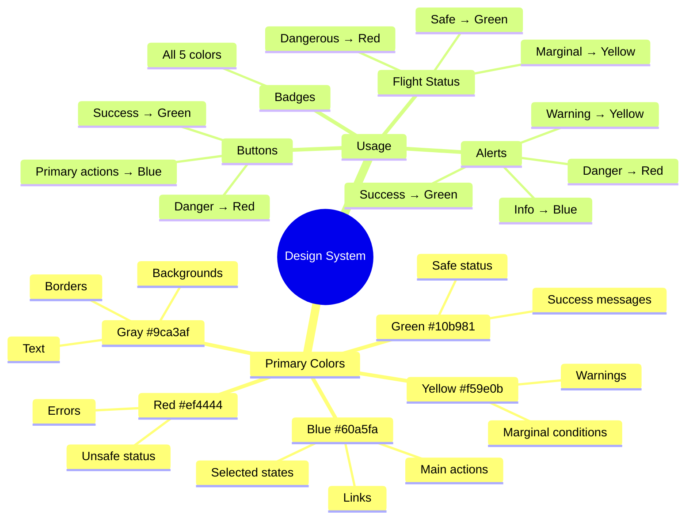

# Application Architecture - Mermaid Diagram

## Complete System Architecture

---

## User Flow Diagram

---

## Component Hierarchy

---

## Data Flow Diagram

```mermaid
graph LR
    subgraph "User Input"
        FORM[Flight Form Input]
    end
    
    subgraph "Processing"
        CALC[Calculate Route]
        WEATHER[Fetch Weather]
        SAFETY[Safety Assessment]
        AI[AI Analysis]
    end
    
    subgraph "Storage"
        SAVE[Save to Firestore]
    end
    
    subgraph "Visualization"
        RENDER[Render on Globe]
        ANIMATE[Animation Playback]
    end
    
    FORM --> CALC
    CALC --> WEATHER
    WEATHER --> SAFETY
    
    SAFETY -->|Unsafe| AI
    AI --> SAVE
    SAFETY -->|Safe| SAVE
    
    SAVE --> RENDER
    RENDER --> ANIMATE
    
    %% Color coding
    classDef input fill:#60a5fa,stroke:#3b82f6,color:#fff
    classDef process fill:#f59e0b,stroke:#d97706,color:#fff
    classDef storage fill:#10b981,stroke:#059669,color:#fff
    classDef output fill:#ef4444,stroke:#dc2626,color:#fff
    
    class FORM input
    class CALC,WEATHER,SAFETY,AI process
    class SAVE storage
    class RENDER,ANIMATE output
```

---

## State Management Flow

---

## File Structure Tree

---

## Color System Diagram

---

## Key
- 🔵 **Primary Blue** (#60a5fa) - Main actions, interactive elements
- 🟢 **Success Green** (#10b981) - Safe status, positive feedback
- 🟡 **Warning Yellow** (#f59e0b) - Marginal conditions, caution
- 🔴 **Danger Red** (#ef4444) - Unsafe status, errors
- ⚪ **Neutral Gray** (#9ca3af) - Text, borders, backgrounds