# Application Architecture - Mermaid Diagram

## Complete System Architecture

---

## User Flow Diagram

---

## Component Hierarchy

---

## Data Flow Diagram

---

## State Management Flow

---

## File Structure Tree

```mermaid
graph TD
    ROOT[flight-scheduler/]
    
    ROOT --> SRC[src/]
    ROOT --> FUNCS[functions/]
    ROOT --> PUBLIC[public/]
    ROOT --> CONFIG[Config Files]
    
    SRC --> COMP[components/]
    SRC --> STYLES[styles/]
    SRC --> SERVICES[services/]
    SRC --> HOOKS[hooks/]
    SRC --> TYPES[types/]
    SRC --> UTILS[utils/]
    
    COMP --> UI[ui/]
    COMP --> AUTH[auth/]
    COMP --> MAP[map/]
    COMP --> FLIGHTS[flights/]
    COMP --> WEATHER[weather/]
    COMP --> LAYOUT[layout/]
    
    UI --> BTN[Button/]
    UI --> CARD[Card/]
    UI --> INPUT[Input/]
    UI --> BADGE[Badge/]
    UI --> ALERT[Alert/]
    UI --> SPIN[Spinner/]
    
    BTN --> BTNTSX[Button.tsx]
    BTN --> BTNCSS[Button.css]
    BTN --> BTNINDEX[index.ts]
    
    STYLES --> VARS[variables.css ⭐]
    STYLES --> GLOBAL[global.css]
    STYLES --> THEMES[themes.css]
    
    SERVICES --> FIREBASE[firebase.ts]
    SERVICES --> WEATHERSVC[weatherService.ts]
    SERVICES --> AISVC[aiService.ts]
    SERVICES --> FLIGHTSVC[flightService.ts]
    
    %% Highlighting important files
    classDef important fill:#f59e0b,stroke:#d97706,color:#fff
    class VARS,FIREBASE,WEATHERSVC important
```

---

## Color System Diagram

```mermaid
mindmap
  root((Design System))
    Primary Colors
      Blue #60a5fa
        Main actions
        Links
        Selected states
      Green #10b981
        Safe status
        Success messages
      Yellow #f59e0b
        Marginal conditions
        Warnings
      Red #ef4444
        Unsafe status
        Errors
      Gray #9ca3af
        Text
        Borders
        Backgrounds
    Usage
      Buttons
        Primary actions → Blue
        Danger → Red
        Success → Green
      Flight Status
        Safe → Green
        Marginal → Yellow
        Dangerous → Red
      Badges
        All 5 colors
      Alerts
        Info → Blue
        Success → Green
        Warning → Yellow
        Danger → Red
```

---

## Key
- 🔵 **Primary Blue** (#60a5fa) - Main actions, interactive elements
- 🟢 **Success Green** (#10b981) - Safe status, positive feedback
- 🟡 **Warning Yellow** (#f59e0b) - Marginal conditions, caution
- 🔴 **Danger Red** (#ef4444) - Unsafe status, errors
- ⚪ **Neutral Gray** (#9ca3af) - Text, borders, backgrounds